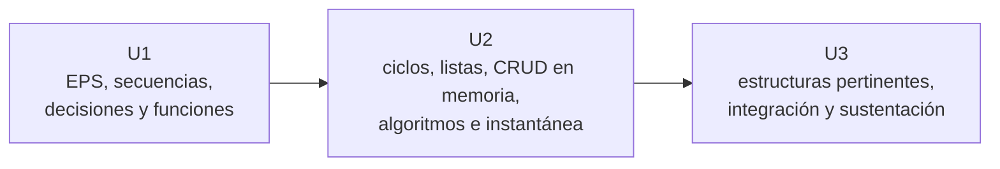

# Productos por unidad

La implementación de referencia vigente utiliza **Python 3**. Las carpetas Java se conservan únicamente como material para la transición posterior a Java 21.

| Unidad | Producto | Implementación vigente |
|---|---|---|
| Unidad I | Portafolio de Soluciones Algorítmicas: secuencias, decisiones y funciones. | `pymarket-cli-u1` |
| Unidad II | Portafolio de Soluciones Modulares y Procesamiento Iterativo de Datos. | `pymarket-cli-u2` |
| Unidad III | Proyecto Integrador Final CLI. | `pymarket-cli-final` |

## Progresión



## Alcance de cada producto

### Unidad I

- Soluciones pequeñas e independientes.
- Modelo Entrada–Proceso–Salida.
- Programación secuencial y condicional.
- Funciones con parámetros y retornos.
- Pruebas breves como apoyo al desarrollo.
- Sin menús repetitivos ni CRUD.

### Unidad II

- Ciclos definidos y condicionales.
- Listas como arreglos unidimensionales.
- Menú repetitivo y validación de entradas.
- CRUD completo mientras la aplicación está en ejecución.
- Búsqueda, ordenamiento, acumulados y ejercicio recursivo.
- Refactorización y análisis introductorio de complejidad.
- Carga inicial desde CSV y reemplazo completo al guardar; no hay CRUD directo sobre el archivo.

### Unidad III

- Integración y estabilización de la aplicación CLI.
- Uso justificado de estructuras estáticas o dinámicas.
- Listas, pilas y colas según el comportamiento requerido.
- Árboles y grafos como práctica guiada; integración opcional si el caso lo justifica.
- Documentación, demostración y sustentación técnica.

## Ejecución en Python

Desde la carpeta de cada producto:

```bash
python app.py
```

El ejemplo institucional trabaja con productos e inventario básico, pero cada equipo puede resolver otro problema real y acotado. La estructura elegida debe responder al dominio y no a la necesidad de acumular temas.
