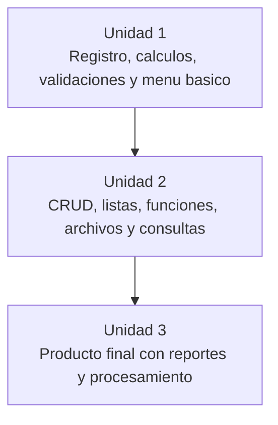

# Productos por Unidad

Estos productos son implementaciones de referencia para el curso de **Fundamentos de Programación**. Siguen la misma lógica progresiva del Proyecto Sello: cada unidad deja una versión ejecutable y la Unidad 3 corresponde al producto final del curso.

## Relación con las unidades

| Carpeta Java | Carpeta Python | Unidad | Producto |
|---|---|---|---|
| `market-cli-u1` | `pymarket-cli-u1` | Unidad 1 | Menú básico de gestión CLI con registro, cálculos y validaciones iniciales. |
| `market-cli-u2` | `pymarket-cli-u2` | Unidad 2 | Aplicación CLI con CRUD modular, memoria, archivos básicos y consultas. |
| `market-cli-final` | `pymarket-cli-final` | Unidad 3 | Aplicación CLI completa con persistencia, movimientos, consultas, matrices, diccionarios y reportes. |

## Ubicación en el repositorio

```text
market-cli/
  market-cli-u1/
    App.java
    README.md
  market-cli-u2/
    App.java
    README.md
  market-cli-final/
    App.java
    README.md
  pymarket-cli-u1/
    app.py
    README.md
  pymarket-cli-u2/
    app.py
    README.md
  pymarket-cli-final/
    app.py
    README.md
```

## Uso metodológico

La intención no es que el estudiante copie literalmente el producto, sino que tenga una referencia clara de crecimiento:



## Ejecución

Cada producto Java se ejecuta desde su propia carpeta:

```bash
cd market-cli-u1
javac App.java
java App
```

```bash
cd market-cli-u2
javac App.java
java App
```

```bash
cd market-cli-final
javac App.java
java App
```

Los productos Python equivalentes conservan el prefijo `py` en la carpeta y se ejecutan con `python app.py`.

## Dominio usado

El ejemplo trabaja con **productos e inventario básico**, porque permite evidenciar una entidad principal, datos relacionados simples, reglas de negocio, persistencia y reportes sin salir del alcance de Fundamentos de Programación.

Los estudiantes pueden elegir otro dominio, siempre que mantengan:

- Problema claro.
- Entidad principal.
- Datos relacionados simples cuando correspondan.
- CRUD o flujo equivalente.
- Persistencia en archivos.
- Consultas y reportes.
- Sustentación del funcionamiento.
