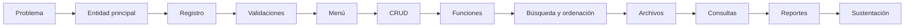

# Proyecto Sello de Fundamentos de Programación

## Propósito

El Proyecto Sello integra las sesiones de **Fundamentos de Programación** alrededor de una misma aplicación CLI desarrollada de forma progresiva. Durante el semestre no se construyen ejercicios independientes; cada nuevo tema fortalece el mismo proyecto hasta convertirlo en una solución funcional, sencilla y sustentable.

El objetivo es demostrar que el estudiante puede analizar un problema, diseñar una solución, implementarla y explicar su funcionamiento utilizando los fundamentos de programación.

```text
Problema -> Algoritmo -> Código -> CRUD -> Persistencia -> Consultas -> Reportes -> Sustentación
```

## El Proyecto

Durante el semestre desarrollarás una **aplicación CLI** que resuelva un problema simple de negocio, gestión o control de información.

El proyecto debe estar basado en una **entidad principal** y puede incorporar **datos relacionados simples**, como cliente, producto, servicio, curso, fecha, estado, categoría o detalle de una operación. No se busca construir un sistema grande, sino una aplicación bien delimitada que permita registrar, consultar, actualizar, eliminar, procesar y reportar información.

El proyecto debe cumplir estas condiciones:

- Resolver un problema concreto.
- Tener una entidad principal claramente definida.
- Incorporar datos relacionados solo cuando ayuden al problema.
- Ejecutarse como aplicación CLI desde la terminal.
- Crecer de manera progresiva durante el curso.
- Integrar los temas desarrollados en clase.
- Ser sustentado por todos los integrantes del equipo.

Antes de programar, define el problema con claridad:

```text
En [contexto], se necesita gestionar [proceso o entidad principal] para registrar, consultar y reportar [información importante], evitando [problema actual].
```

Ejemplos válidos:

- Gestión de productos e inventario básico.
- Gestión de ventas simples.
- Gestión de préstamos.
- Gestión de reservas o citas.
- Gestión de clientes.
- Gestión de notas o asistencia.

No se considera Proyecto Sello:

- Un conjunto de ejercicios independientes.
- Un menú que solo llama ejemplos de clase.
- Un programa sin entidad principal ni problema claro.
- Una aplicación con datos fijos que no permite registrar información.
- Un proyecto copiado sin personalización del dominio, datos, reglas y reportes.
- Una solución que el estudiante no puede explicar durante la sustentación.

## Evolución del Proyecto

Cada unidad incorpora nuevas capacidades al producto.

| Unidad | Temas principales | Evolución del proyecto |
|---|---|---|
| Unidad 1 | Variables, operadores, entrada/salida, condicionales y menús. | Primera versión funcional con captura de datos, cálculos, validaciones y menú básico. |
| Unidad 2 | Listas/arreglos, bucles, funciones, búsqueda, ordenación y archivos. | CRUD modular con varios registros, organización del código y persistencia básica. |
| Unidad 3 | Consultas, reportes, matrices y diccionarios. | Procesamiento de información, generación de reportes y versión final sustentada. |



## Cronograma

| Hito | Momento | Producto esperado |
|---|---|---|
| S2 | Aprobación del brief | Problema, contexto, entidad principal, datos relacionados, operaciones iniciales y alcance. |
| S5 | Base funcional | Registro inicial, cálculos, validaciones y menú básico. |
| S12 | Producto intermedio | CRUD modular con listas/arreglos, funciones, búsqueda, ordenación, archivos y consultas. |
| S15 | Producto final | Aplicación CLI completa, reportes, evidencias y sustentación técnica. |
| S16 | Cierre individual | Evaluación teórico-práctica y recuperación de competencias pendientes. |

El brief de la semana 2 es obligatorio. Su propósito es validar que el proyecto tiene un problema claro, un alcance viable y una entidad principal adecuada para FP antes de avanzar con el desarrollo.

## Producto Final

Al finalizar el curso, la aplicación debe incorporar como mínimo:

- Menú interactivo.
- Registro de información.
- Listado o consulta de registros.
- Búsqueda.
- Edición.
- Eliminación.
- Validaciones.
- Funciones.
- Listas o arreglos.
- Ordenación.
- Persistencia en archivos.
- Consultas y agregaciones.
- Reportes por terminal o archivo.
- Uso pertinente de matrices o diccionarios cuando el problema lo justifique.

Artefactos mínimos de entrega:

- Código fuente de la aplicación CLI.
- Archivo o carpeta de datos.
- Descripción breve del problema resuelto.
- Descripción de la entidad principal y datos relacionados.
- Casos de prueba básicos.
- Evidencia de ejecución.
- Reporte o resumen del proyecto.
- Sustentación técnica.

Cada componente debe estar conectado con el problema elegido. Por ejemplo, si el proyecto gestiona productos, las búsquedas, validaciones, reportes y archivos deben trabajar con productos, stock, categorías o movimientos reales del caso.

## Evaluación

El producto final se evalúa como una aplicación completa, no como una suma de ejercicios. La nota debe reflejar qué tan bien el estudiante convierte un problema simple en una solución CLI funcional, ordenada y sustentable.

| Criterio | Qué se observa |
|---|---|
| Problema y alcance | El proyecto responde a una necesidad clara, gestiona un proceso simple con entidad principal y datos relacionados, y mantiene un alcance adecuado para FP. |
| Funcionalidad | La aplicación permite registrar, listar, buscar, editar, eliminar, consultar y generar reportes básicos según el problema elegido. |
| Aplicación de fundamentos | El código evidencia uso correcto de variables, operadores, condicionales, bucles, listas/arreglos, funciones, archivos, búsqueda, ordenación y estructuras auxiliares cuando corresponda. |
| Integración del producto | Las sesiones aportan al mismo proyecto; no hay módulos inconexos ni ejercicios pegados sin relación con el dominio. |
| Manejo de datos | Los registros se almacenan, recuperan y procesan correctamente; la persistencia permite cerrar y volver a ejecutar la aplicación sin perder la información principal. |
| Validaciones y control de errores | La aplicación controla entradas incorrectas, opciones inválidas, datos incompletos y casos básicos que podrían romper la ejecución. |
| Organización del código | Las funciones separan responsabilidades, reducen repetición y permiten entender el flujo principal del programa. |
| Pruebas y evidencia | El estudiante presenta casos de prueba básicos que demuestran las operaciones principales y situaciones límite simples. |
| Reportes | Las consultas o reportes muestran información útil para el usuario, no solo datos impresos sin propósito. |
| Sustentación técnica | El estudiante explica el problema, el diseño de la solución, el código, las decisiones tomadas y las limitaciones del producto. |
| Sustentación profesional | El estudiante realiza una exposición ordenada, respeta los tiempos, participa activamente si el trabajo es grupal, demuestra en vivo su aporte, responde preguntas y mantiene una presentación personal adecuada al contexto académico. |

La sustentación profesional forma parte de la evaluación porque el producto final no solo debe funcionar; también debe ser presentado, explicado y defendido con responsabilidad académica.

## Sustentación

La sustentación no consiste únicamente en hablar del programa ni en mostrar diapositivas. El estudiante debe demostrar que comprende lo que construyó, ejecutar el producto en vivo y explicar cómo evolucionó durante el curso.

| Momento | Tiempo sugerido | Propósito |
|---|---:|---|
| Exposición técnica | 10 minutos | Presentar el problema, alcance, estructura de la solución, componentes principales y evidencias del avance. |
| Demostración en vivo | 5 minutos | Ejecutar la aplicación CLI y comprobar que las funciones principales trabajan con datos reales del proyecto. |

Durante la sustentación se debe:

- Presentar el problema, la entidad principal y los datos relacionados.
- Explicar las principales funciones de la aplicación CLI.
- Mostrar registro, consulta/listado, búsqueda, edición o eliminación.
- Evidenciar carga y guardado de información en archivos.
- Mostrar una consulta, agregación o reporte relacionado con el problema.
- Explicar al menos una validación y una decisión importante del código.
- Reconocer limitaciones del producto y posibles mejoras.

Si el proyecto es grupal, cada integrante debe mostrar en vivo la parte que desarrolló o explicar una sección concreta del código. No basta con que una sola persona ejecute toda la aplicación mientras los demás observan.

Para la exposición, el estudiante o equipo debe preparar:

- Aplicación lista para ejecutarse.
- Código fuente organizado.
- Archivo de datos con registros de prueba.
- Casos de prueba mínimos.
- Diapositivas breves o guía visual de apoyo.
- Evidencia del avance por hitos: S2, S5, S12 y S15.
- Distribución clara de responsabilidades por integrante.

La presentación personal también comunica responsabilidad y respeto por el trabajo realizado. No se evalúa la marca de la ropa ni el estilo personal, pero sí se espera una apariencia limpia, ordenada y adecuada para una exposición académica.

Para la sustentación se recomienda:

- Usar vestimenta limpia, ordenada y apropiada para una presentación académica.
- Evitar ropa deportiva, buzos, sandalias o prendas demasiado informales.
- Mantener el cabello limpio y ordenado.
- Cuidar la higiene personal.
- Evitar accesorios, gorras o elementos que distraigan durante la exposición.
- Presentarse con actitud profesional, puntualidad y disposición para responder preguntas.

## Resultado Esperado

Al finalizar el curso, el estudiante debe demostrar que puede transformar un problema simple en una aplicación CLI funcional utilizando los fundamentos de programación.

```text
Problema
  ↓
Análisis
  ↓
Algoritmo
  ↓
Programación
  ↓
CRUD
  ↓
Persistencia
  ↓
Consultas
  ↓
Reportes
  ↓
Aplicación CLI funcional
  ↓
Sustentación
```

El Proyecto Sello representa la integración de los conocimientos adquiridos durante el curso. Más que desarrollar un sistema complejo, el propósito es evidenciar la capacidad para analizar un problema, implementar una solución coherente y explicar técnicamente las decisiones tomadas durante su construcción.
