# Proyecto Sello de Fundamentos de Programación

## Propósito

El proyecto sello articula las 16 sesiones de **Fundamentos de Programación** alrededor de una misma aplicación CLI desarrollada de manera progresiva para resolver un problema básico de gestión.

La secuencia formativa del proyecto es:

```text
Algoritmos -> Menú -> CRUD -> Archivos -> Consultas -> Reportes -> Sustentación
```

El estudiante no desarrolla ejercicios aislados. Cada sesión agrega una capacidad visible al producto, de modo que los contenidos del curso se evidencien en una aplicación funcional, sencilla y defendible.

Esta guía debe ayudarte a decidir qué problema resolver, qué construir en cada unidad, qué evidencias presentar y cómo sustentar tu trabajo al final del curso.

## Naturaleza del Proyecto

Tu proyecto debe cumplir estas condiciones:

- Resuelve un problema básico de negocio, gestión o control de información.
- Se implementa como una aplicación CLI, es decir, una aplicación que se ejecuta desde la terminal.
- Integra lógica, control de flujo y manejo de datos.
- Se desarrolla de manera progresiva durante el curso.
- Puede desarrollarse en equipo, pero cada integrante debe sustentar su aporte y comprender el funcionamiento del producto.

No se aceptan programas inconexos, ejercicios sueltos o soluciones sin sentido aplicado. El producto debe evidenciar una finalidad clara: registrar, consultar, actualizar, eliminar, procesar y reportar información de un proceso simple, una entidad principal y sus datos relacionados.

## Problema a Resolver

Antes de escribir código, debes definir el problema que tu aplicación resolverá. No basta con decir "haré un CRUD"; debes explicar qué información se gestiona, quién la usaría y para qué sirve.

Una buena formulación del problema puede tener esta forma:

```text
En [contexto], se necesita gestionar [entidad o proceso] para registrar, consultar y reportar [información importante], evitando [problema actual].
```

Ejemplos:

- En una tienda pequeña, se necesita gestionar productos para registrar existencias, consultar precios y reportar productos con bajo stock.
- En una biblioteca, se necesita gestionar préstamos para registrar libros prestados, consultar devoluciones pendientes y reportar préstamos vencidos.
- En un curso, se necesita gestionar notas para registrar calificaciones, calcular promedios y reportar estudiantes aprobados o desaprobados.

## Producto Sello

**Aplicación CLI para la gestión de un proceso simple de negocio o información, basado en una entidad principal y datos relacionados.**

El producto no se evalúa por tener muchas opciones, sino por resolver de manera ordenada un problema concreto usando los fundamentos de programación.

## Artefactos del Producto Sello

Al finalizar el curso, debes entregar evidencias claras del desarrollo del proyecto. Los artefactos mínimos son:

- Código fuente de la aplicación CLI.
- Archivo o carpeta de datos utilizada por la aplicación.
- Descripción breve del problema resuelto.
- Descripción del proceso gestionado, la entidad principal y los datos relacionados.
- Casos de prueba básicos.
- Evidencia de ejecución del programa.
- Reporte o resumen del proyecto.
- Sustentación técnica del producto.

## Componentes Funcionales de la Aplicación

Tu aplicación CLI debe incorporar progresivamente estos componentes:

- Proceso gestionado y entidad principal definidos.
- Entrada y salida de datos por terminal.
- Registro de datos estructurados.
- Cálculos secuenciales.
- Validaciones con estructuras condicionales.
- Menú de opciones.
- CRUD en memoria con listas o arreglos.
- Modularización mediante funciones.
- Búsqueda y ordenación.
- Persistencia básica en archivos.
- Consultas, agregaciones y reportes por terminal.
- Uso de matrices y diccionarios para procesamiento específico.
- Exportación o generación de reportes finales.
- Sustentación técnica del producto.

Cada componente debe estar conectado con el problema elegido. Por ejemplo, si tu proyecto gestiona productos, las búsquedas, validaciones, reportes y archivos deben trabajar con productos, stock, categorías o movimientos reales del caso, no con datos inventados solo para cumplir una sesión.

## Alcance del Proyecto

El proyecto debe ser suficientemente simple para un primer curso de programación, pero suficientemente completo para demostrar el dominio progresivo de los fundamentos.

Todo proyecto debe tener una entidad principal claramente definida. Puede incorporar datos relacionados simples, como cliente, producto, servicio, curso, fecha, estado, categoría o detalle de una operación, siempre que no convierta el trabajo en un sistema demasiado amplio para FP.

Ejemplos de dominios adecuados:

- Gestión de productos.
- Gestión de clientes.
- Gestión de ventas simples.
- Gestión de reservas.
- Gestión de préstamos.
- Gestión de inventario básico.
- Gestión de notas o asistencia.

No se espera una aplicación con interfaz gráfica, base de datos ni arquitectura avanzada. El foco está en el pensamiento algorítmico, la programación estructurada, la resolución de un problema concreto y la explicación clara del código.

Evita proyectos demasiado amplios. Para este curso es mejor resolver bien un problema pequeño que intentar construir un sistema grande sin terminarlo.

## Cómo Elegir el Proyecto

Para elegir tu proyecto, verifica que puedas responder estas preguntas:

- ¿Qué problema concreto resuelve?
- ¿Qué entidad principal se va a gestionar?
- ¿Qué datos necesita registrar esa entidad?
- ¿Qué operaciones realizará el usuario?
- ¿Qué consultas o reportes serían útiles?
- ¿Qué reglas o validaciones debe cumplir?

Si no puedes responder estas preguntas, el proyecto todavía está demasiado difuso.

Una entidad adecuada para FP debe tener varios datos simples. Por ejemplo, un producto puede tener código, nombre, categoría, precio y stock. Una cita puede tener cliente, servicio, fecha, hora y estado. Una nota puede relacionarse con estudiante, curso, evaluación y calificación.

## Qué No Debe Presentarse

No se considera proyecto sello:

- Un conjunto de ejercicios separados sin relación entre sí.
- Un menú que solo llama ejemplos aislados de cada tema.
- Un programa que no gestiona un proceso, una entidad principal o datos relacionados.
- Una aplicación que usa datos fijos y no permite registrar información.
- Un proyecto copiado sin personalización del dominio, datos, reglas y reportes.
- Una solución que el estudiante no puede explicar durante la sustentación.

## Alineamiento por sesiones

| Sesiones | Contenido central | Avance del proyecto | Evidencia esperada |
|---|---|---|---|
| S1-S2 | Datos, variables, entrada/salida, operadores y secuencia. | Definición del proceso, entidad principal y primer registro secuencial. | Programa que captura, procesa y muestra datos básicos. |
| S3-S4 | Condicionales simples, compuestas, múltiples y menú básico. | Validaciones iniciales y menú principal. | Menú CLI con reglas condicionales. |
| S5 | Evaluación U1. | Primer corte del producto. | Menú básico con registro, cálculos y validaciones. |
| S6-S7 | Listas/arreglos, `for`, `while` y menú interactivo. | CRUD en memoria e interacción repetitiva. | Registro y listado de varios elementos con control de flujo. |
| S8 | Funciones, parámetros, retorno y recursividad. | Modularización del CRUD. | Funciones separadas para registrar, listar, buscar u operar datos. |
| S9 | Búsqueda y ordenación. | Consulta y organización de registros. | Búsqueda lineal y ordenación aplicada a los registros. |
| S10 | Archivos. | Persistencia básica. | Guardar y cargar registros desde archivo. |
| S11 | Consultas, agregaciones y reportes. | Procesamiento inicial de datos persistidos. | Filtros, conteos, sumas, promedios y reportes por terminal. |
| S12 | Evaluación U2. | Segundo corte del producto. | CRUD modular con memoria, archivos y consultas. |
| S13 | Matrices y diccionarios. | Procesamiento avanzado según el problema. | Reporte tabular, consulta por clave o estructura auxiliar. |
| S14 | Reportes y exportación. | Salidas finales del sistema. | Reporte en texto, CSV, Excel o PDF según alcance. |
| S15 | Sustentación. | Presentación técnica del producto. | Demo funcional y explicación del código. |
| S16 | Evaluación final. | Cierre individual. | Evaluación teórico-práctica y recuperación de competencias pendientes. |

## Hitos del Proyecto

### Hito S2: Aprobación del brief del proyecto

Al finalizar la sesión 2, el estudiante o equipo debe presentar y aprobar el brief del proyecto. Este hito valida que el proyecto tiene un problema claro, un alcance viable y una entidad principal adecuada para FP.

| Componente | Evidencia |
|---|---|
| Problema | Situación concreta que se desea resolver. |
| Contexto | Usuario, negocio o proceso donde se aplicará la solución. |
| Entidad principal | Datos básicos que serán registrados y gestionados. |
| Datos relacionados | Información adicional necesaria sin ampliar demasiado el sistema. |
| Operaciones iniciales | Registro, consulta o cálculo básico que tendrá sentido para el caso. |
| Alcance | Límites claros de lo que el proyecto sí hará y no hará. |

### Hito S5: Base funcional

Al finalizar la sesión 5, el estudiante debe contar con una primera versión ejecutable del proyecto.

| Componente | Evidencia |
|---|---|
| Entidad | Datos principales definidos. |
| Entrada/salida | Captura y visualización por terminal. |
| Secuencia | Cálculos o procesamiento básico. |
| Condicionales | Validaciones y reglas simples. |
| Menú | Opciones iniciales del sistema. |

### Hito S12: Producto funcional intermedio

Al finalizar la sesión 12, el producto debe funcionar como una aplicación CLI con CRUD modular y persistencia básica.

| Componente | Evidencia |
|---|---|
| Listas/arreglos | Varios registros almacenados en memoria. |
| Menú interactivo | Repetición hasta que el usuario decida salir. |
| Funciones | Código organizado por responsabilidades. |
| Búsqueda y ordenación | Consulta y organización de registros. |
| Archivos | Carga y guardado de datos. |
| Consultas | Filtros, agregaciones y reportes simples. |

### Hito S15: Producto sello final

Al finalizar la sesión 15, el estudiante debe sustentar una aplicación completa y explicar cómo evolucionó.

| Componente | Evidencia |
|---|---|
| CRUD completo | Registrar, listar, buscar, editar y eliminar. |
| Persistencia | Archivo actualizado y recuperable. |
| Procesamiento | Consultas, agregaciones, matrices o diccionarios. |
| Reportes | Salida final legible para el usuario. |
| Sustentación | Explicación del flujo, estructuras usadas y decisiones del código. |

## Criterios de Evaluación del Producto Final

El producto final se evalúa como una aplicación completa, no como una suma de ejercicios. La nota debe reflejar qué tan bien el estudiante convierte un problema simple en una solución CLI funcional, ordenada y sustentable.

| Criterio | Qué se observa |
|---|---|
| Problema y alcance | El proyecto responde a una necesidad clara, gestiona un proceso simple con entidad principal y datos relacionados, y mantiene un alcance adecuado para FP. |
| Funcionalidad | La aplicación permite registrar, listar, buscar, editar, eliminar, consultar y generar reportes básicos según el problema elegido. |
| Aplicación de fundamentos | El código evidencia uso correcto de variables, operadores, condicionales, bucles, listas/arreglos, funciones, archivos, búsquedas, ordenación y estructuras auxiliares cuando corresponda. |
| Integración del producto | Las sesiones aportan al mismo proyecto; no hay módulos inconexos ni ejercicios pegados sin relación con el dominio. |
| Manejo de datos | Los registros se almacenan, recuperan y procesan correctamente; la persistencia permite cerrar y volver a ejecutar la aplicación sin perder la información principal. |
| Validaciones y control de errores | La aplicación controla entradas incorrectas, opciones inválidas, datos incompletos y casos básicos que podrían romper la ejecución. |
| Organización del código | Las funciones separan responsabilidades, reducen repetición y permiten entender el flujo principal del programa. |
| Pruebas y evidencia | El estudiante presenta casos de prueba básicos que demuestran las operaciones principales y situaciones límite simples. |
| Reportes y salida de información | Los reportes o consultas muestran información útil para el usuario, no solo datos impresos sin propósito. |
| Sustentación técnica | El estudiante explica el problema, el diseño de la solución, el código, las decisiones tomadas y las limitaciones del producto. |
| Sustentación profesional | El estudiante realiza una exposición ordenada, respeta los tiempos, participa activamente si el trabajo es grupal, demuestra en vivo su aporte, responde preguntas y mantiene una presentación personal adecuada al contexto académico. |

La sustentación profesional forma parte de la evaluación porque el producto final no solo debe funcionar; también debe ser presentado, explicado y defendido con responsabilidad académica.

## Sustentación del Proyecto

La sustentación no consiste únicamente en hablar del programa ni en mostrar diapositivas. El estudiante debe demostrar que comprende lo que construyó, ejecutar el producto en vivo y explicar cómo evolucionó durante el curso.

La sustentación por grupo se organiza en dos momentos:

| Momento | Tiempo sugerido | Propósito |
|---|---:|---|
| Exposición técnica | 10 minutos | Presentar el problema, alcance, estructura de la solución, componentes principales y evidencias del avance. |
| Demostración en vivo | 5 minutos | Ejecutar la aplicación CLI y comprobar que las funciones principales trabajan con datos reales del proyecto. |

Durante la exposición se espera que el estudiante:

- Presente el problema elegido, el proceso gestionado, la entidad principal y los datos relacionados.
- Explique las principales funciones de la aplicación CLI.
- Explique al menos una validación, una búsqueda, una consulta y un reporte.
- Identifique qué estructuras de programación utilizó y por qué.
- Reconozca limitaciones del producto y posibles mejoras.

Durante la demostración en vivo se debe mostrar:

- Registro de un nuevo dato.
- Listado o consulta de registros.
- Búsqueda de información.
- Edición o eliminación de un registro.
- Carga o guardado de información en archivos.
- Reporte o consulta agregada relacionada con el problema.

Si el proyecto es grupal, cada integrante debe mostrar en vivo la parte que desarrolló o explicar una sección concreta del código. No basta con que una sola persona ejecute toda la aplicación mientras los demás observan.

## Recursos para la Sustentación

Para una presentación ordenada, el estudiante o equipo debe preparar:

- Aplicación lista para ejecutarse.
- Código fuente organizado.
- Archivo de datos con registros de prueba.
- Casos de prueba mínimos.
- Diapositivas breves o guía visual de apoyo.
- Evidencia del avance por hitos: S5, S12 y S15.
- Distribución clara de responsabilidades por integrante.

Las diapositivas no deben reemplazar la demostración del producto. Su función es ayudar a explicar el problema, el alcance, las decisiones técnicas y los resultados. La evidencia principal es la aplicación ejecutándose y el estudiante explicando el código que implementó.

## Comunicación y Presentación

La sustentación forma parte del producto profesional. Por ello, se espera una comunicación clara, ordenada y respetuosa.

El estudiante debe:

- Explicar con lenguaje técnico básico, sin leer todo el contenido.
- Mantener una secuencia lógica: problema, solución, demo, código, evidencias y cierre.
- Distribuir la participación si el proyecto es grupal.
- Responder preguntas sobre el código que desarrolló.
- Presentarse de manera adecuada al contexto académico.
- Respetar el tiempo asignado y priorizar lo esencial.

## Presentación Personal

La presentación personal también comunica responsabilidad y respeto por el trabajo realizado. No se evalúa la marca de la ropa ni el estilo personal, pero sí se espera una apariencia limpia, ordenada y adecuada para una exposición académica.

Para la sustentación se recomienda:

- Usar vestimenta limpia, ordenada y apropiada para una presentación académica.
- Evitar ropa deportiva, buzos, sandalias o prendas demasiado informales.
- Mantener el cabello limpio y ordenado.
- Cuidar la higiene personal.
- Evitar accesorios, gorras o elementos que distraigan durante la exposición.
- Presentarse con actitud profesional, puntualidad y disposición para responder preguntas.

El objetivo no es uniformar a los estudiantes, sino preparar una experiencia de sustentación seria, respetuosa y cercana a una presentación profesional.

Una buena sustentación no oculta errores: los reconoce, explica qué se intentó resolver y muestra qué se aprendió durante el proceso.

## Consideraciones Metodológicas

El proyecto sello debe crecer por versiones:

- **S5:** versión inicial con entrada, salida, cálculos, validaciones y menú básico.
- **S12:** versión intermedia con CRUD modular, listas, archivos, búsqueda, ordenación y consultas.
- **S15:** versión final con procesamiento avanzado, reportes y sustentación.

El docente puede permitir que los estudiantes trabajen con plantillas, pero cada equipo o estudiante debe personalizar dominio, datos, reglas y reportes. El objetivo no es copiar una aplicación, sino aprender a construirla gradualmente.

## Flujo de Trabajo Recomendado

```mermaid
flowchart LR
    A[Proceso y entidad principal] --> B[Registro secuencial]
    B --> C[Validaciones y menú]
    C --> D[CRUD en memoria]
    D --> E[Funciones]
    E --> F[Búsqueda y ordenación]
    F --> G[Archivos]
    G --> H[Consultas y agregaciones]
    H --> I[Matrices y diccionarios]
    I --> J[Reportes]
    J --> K[Producto sello sustentado]
```



## Resultado Esperado

Al cierre del curso, el estudiante debe demostrar que puede convertir un problema simple en una aplicación CLI funcional:

```text
Problema simple -> Algoritmo -> Código -> CRUD -> Persistencia -> Reportes -> Sustentación
```

El valor del proyecto sello no está en la complejidad del sistema, sino en evidenciar que el estudiante comprende las estructuras fundamentales y puede integrarlas en un producto coherente.
