# Proyecto Sello de Fundamentos de Programación

## Propósito

El proyecto sello articula las 16 sesiones de **Fundamentos de Programación** alrededor de una misma aplicación de consola desarrollada de manera progresiva.

La secuencia formativa del proyecto es:

```text
Algoritmos -> Menú -> CRUD -> Archivos -> Consultas -> Reportes -> Sustentación
```

El estudiante no desarrolla ejercicios aislados. Cada sesión agrega una capacidad visible al producto, de modo que los contenidos del curso se evidencien en una aplicación funcional, sencilla y defendible.

## Producto Sello

**Aplicación de consola para la gestión de una entidad de negocio o proceso simple.**

El producto sello incluye:

- Entidad o proceso principal definido.
- Entrada y salida de datos por consola.
- Registro de datos estructurados.
- Cálculos secuenciales.
- Validaciones con estructuras condicionales.
- Menú de opciones.
- CRUD en memoria con listas o arreglos.
- Modularización mediante funciones.
- Búsqueda y ordenación.
- Persistencia básica en archivos.
- Consultas, agregaciones y reportes por consola.
- Uso de matrices y diccionarios para procesamiento específico.
- Exportación o generación de reportes finales.
- Sustentación técnica del producto.

## Alcance del Proyecto

El proyecto debe ser suficientemente simple para un primer curso de programación, pero suficientemente completo para demostrar el dominio progresivo de los fundamentos.

Ejemplos de dominios adecuados:

- Gestión de productos.
- Gestión de clientes.
- Gestión de ventas simples.
- Gestión de reservas.
- Gestión de préstamos.
- Gestión de inventario básico.
- Gestión de notas o asistencia.

No se espera una aplicación con interfaz gráfica, base de datos ni arquitectura avanzada. El foco está en el pensamiento algorítmico, la programación estructurada y la explicación clara del código.

## Alineamiento por sesiones

| Sesiones | Contenido central | Avance del proyecto | Evidencia esperada |
|---|---|---|---|
| S1-S2 | Datos, variables, entrada/salida, operadores y secuencia. | Definición de la entidad y primer registro secuencial. | Programa que captura, procesa y muestra datos básicos. |
| S3-S4 | Condicionales simples, compuestas, múltiples y menú básico. | Validaciones iniciales y menú principal. | Menú de consola con reglas condicionales. |
| S5 | Evaluación U1. | Primer corte del producto. | Menú básico con registro, cálculos y validaciones. |
| S6-S7 | Listas/arreglos, `for`, `while` y menú interactivo. | CRUD en memoria e interacción repetitiva. | Registro y listado de varios elementos con control de flujo. |
| S8 | Funciones, parámetros, retorno y recursividad. | Modularización del CRUD. | Funciones separadas para registrar, listar, buscar u operar datos. |
| S9 | Búsqueda y ordenación. | Consulta y organización de registros. | Búsqueda lineal y ordenación aplicada a los registros. |
| S10 | Archivos. | Persistencia básica. | Guardar y cargar registros desde archivo. |
| S11 | Consultas, agregaciones y reportes. | Procesamiento inicial de datos persistidos. | Filtros, conteos, sumas, promedios y reportes por consola. |
| S12 | Evaluación U2. | Segundo corte del producto. | CRUD modular con memoria, archivos y consultas. |
| S13 | Matrices y diccionarios. | Procesamiento avanzado según el problema. | Reporte tabular, consulta por clave o estructura auxiliar. |
| S14 | Reportes y exportación. | Salidas finales del sistema. | Reporte en texto, CSV, Excel o PDF según alcance. |
| S15 | Sustentación. | Presentación técnica del producto. | Demo funcional y explicación del código. |
| S16 | Evaluación final. | Cierre individual. | Evaluación teórico-práctica y recuperación de competencias pendientes. |

## Hitos del Proyecto

### Hito S5: Base funcional

Al finalizar la sesión 5, el estudiante debe contar con una primera versión ejecutable del proyecto.

| Componente | Evidencia |
|---|---|
| Entidad | Datos principales definidos. |
| Entrada/salida | Captura y visualización por consola. |
| Secuencia | Cálculos o procesamiento básico. |
| Condicionales | Validaciones y reglas simples. |
| Menú | Opciones iniciales del sistema. |

### Hito S12: Producto funcional intermedio

Al finalizar la sesión 12, el producto debe funcionar como una aplicación de consola con CRUD modular y persistencia básica.

| Componente | Evidencia |
|---|---|
| Listas/arreglos | Varios registros almacenados en memoria. |
| Menú interactivo | Repetición hasta que el usuario decida salir. |
| Funciones | Código organizado por responsabilidades. |
| Búsqueda y ordenación | Consulta y organización de registros. |
| Archivos | Carga y guardado de datos. |
| Consultas | Filtros, agregaciones y reportes simples. |

### Hito S15: Producto sello final

Al finalizar la sesión 15, el estudiante debe sustentar una aplicación completa y explicar cómo evolucionó.

| Componente | Evidencia |
|---|---|
| CRUD completo | Registrar, listar, buscar, editar y eliminar. |
| Persistencia | Archivo actualizado y recuperable. |
| Procesamiento | Consultas, agregaciones, matrices o diccionarios. |
| Reportes | Salida final legible para el usuario. |
| Sustentación | Explicación del flujo, estructuras usadas y decisiones del código. |

## Criterios de Integración

Para que el proyecto se considere un producto sello del curso, debe cumplir estas condiciones:

- Cada sesión debe aportar una mejora concreta al mismo proyecto.
- La entidad o proceso no debe cambiar sin justificación durante el semestre.
- Las validaciones deben proteger entradas incorrectas o incompletas.
- El menú debe permitir navegar las operaciones principales.
- El CRUD debe trabajar con varios registros, no solo con variables sueltas.
- Las funciones deben reducir repetición y separar responsabilidades.
- La persistencia debe permitir cerrar y volver a ejecutar el programa sin perder todos los datos.
- Las consultas y reportes deben usar los registros almacenados, no datos fijos.
- La sustentación debe demostrar comprensión del código, no solo ejecución.

## Consideraciones Metodológicas

El proyecto sello debe crecer por versiones:

- **S5:** versión inicial con entrada, salida, cálculos, validaciones y menú básico.
- **S12:** versión intermedia con CRUD modular, listas, archivos, búsqueda, ordenación y consultas.
- **S15:** versión final con procesamiento avanzado, reportes y sustentación.

El docente puede permitir que los estudiantes trabajen con plantillas, pero cada equipo o estudiante debe personalizar dominio, datos, reglas y reportes. El objetivo no es copiar una aplicación, sino aprender a construirla gradualmente.

## Flujo de Trabajo Recomendado

```mermaid
flowchart LR
    A[Entidad o proceso] --> B[Registro secuencial]
    B --> C[Validaciones y menú]
    C --> D[CRUD en memoria]
    D --> E[Funciones]
    E --> F[Búsqueda y ordenación]
    F --> G[Archivos]
    G --> H[Consultas y agregaciones]
    H --> I[Matrices y diccionarios]
    I --> J[Reportes]
    J --> K[Producto sello sustentado]
```



## Resultado Esperado

Al cierre del curso, el estudiante debe demostrar que puede convertir un problema simple en una aplicación de consola funcional:

```text
Problema simple -> Algoritmo -> Código -> CRUD -> Persistencia -> Reportes -> Sustentación
```

El valor del proyecto sello no está en la complejidad del sistema, sino en evidenciar que el estudiante comprende las estructuras fundamentales y puede integrarlas en un producto coherente.
