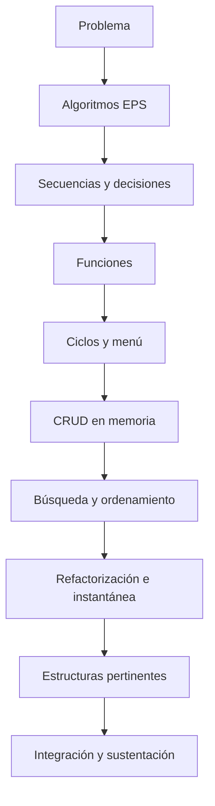

# Proyecto Sello de Fundamentos de Programación

## 1. Propósito

El Proyecto Integrador articula las sesiones de **Fundamentos de Programación** alrededor de un problema común. La Unidad I reúne soluciones algorítmicas pequeñas; desde la Unidad II estas capacidades se integran progresivamente en una aplicación CLI funcional, sencilla y sustentable.

El objetivo es demostrar que el estudiante puede analizar un problema, diseñar una solución, implementarla y explicar su funcionamiento utilizando los fundamentos de programación.

### Competencia o capacidad del proyecto

Al finalizar el Proyecto Sello, el estudiante demuestra que puede analizar un problema simple y construir una aplicación CLI funcional, aplicando fundamentos de programación, manejo básico de datos, validaciones, persistencia en archivos, pruebas iniciales y sustentación integral de su solución.

### Competencias relacionadas

| Código | Competencia | Relación con el proyecto |
|---|---|---|
| CE023 | Programación | Evidencia la construcción inicial de una aplicación funcional mediante fundamentos de programación. |
| CE022 | Ingeniería de la Información | Evidencia manejo básico de datos, persistencia en archivos, consultas y procesamiento simple. |
| CE024 | Calidad de Software | Evidencia validaciones, pruebas iniciales, documentación, repositorio y sustentación integral. |

```text
Problema -> Algoritmo -> Funciones -> Ciclos -> CRUD en memoria -> Instantánea -> Estructuras -> Sustentación
```

## 2. El Proyecto

Durante el semestre desarrollarás una **aplicación CLI** que resuelva un problema simple de negocio, gestión o control de información.

El proyecto debe estar basado en una **entidad principal** y puede incorporar **datos relacionados simples**, como cliente, producto, servicio, curso, fecha, estado, categoría o detalle de una operación. No se busca construir un sistema grande, sino una aplicación bien delimitada que permita registrar, consultar, actualizar, eliminar, procesar y reportar información.

El proyecto debe cumplir estas condiciones:

- Resolver un problema concreto.
- Tener una entidad principal claramente definida.
- Incorporar datos relacionados solo cuando ayuden al problema.
- Ejecutarse como aplicación CLI desde la terminal.
- Crecer de manera progresiva durante el curso.
- Integrar los temas desarrollados en clase.
- Ser sustentado por todos los integrantes del equipo.

Antes de programar, define el problema con claridad:

```text
En [contexto], se necesita gestionar [proceso o entidad principal] para registrar, consultar y reportar [información importante], evitando [problema actual].
```

Ejemplos válidos:

- Gestión de productos e inventario básico.
- Gestión de ventas simples.
- Gestión de préstamos.
- Gestión de reservas o citas.
- Gestión de clientes.
- Gestión de notas o asistencia.

No se considera Proyecto Sello:

- Un conjunto de ejercicios independientes.
- Un menú que solo llama ejemplos de clase.
- Un programa sin entidad principal ni problema claro.
- Una aplicación con datos fijos que no permite registrar información.
- Un proyecto copiado sin personalización del dominio, datos, reglas y reportes.
- Una solución que el estudiante no puede explicar durante la sustentación.

## 3. Evolución del Proyecto

Cada unidad incorpora nuevas capacidades al producto.

| Unidad | Temas principales | Evolución del proyecto |
|---|---|---|
| Unidad 1 | EPS, variables, entrada/salida, operaciones, condicionales, funciones y TDD introductorio. | Portafolio de soluciones secuenciales y condicionales; todavía sin menú repetitivo ni CRUD. |
| Unidad 2 | Ciclos, listas, búsqueda, ordenamiento, acumulados, recursividad, CRUD en memoria, refactorización y archivos. | Portafolio integrado con menú, operaciones en memoria, carga inicial y reemplazo de una instantánea. |
| Unidad 3 | Estructuras estáticas, listas, pilas, colas, árboles y grafos. | Integración de estructuras pertinentes y versión final documentada y sustentada. |



### Alineamiento por sesiones

Este alineamiento muestra cómo cada bloque de sesiones agrega capacidades al mismo proyecto CLI y prepara al estudiante para trabajar luego con proyectos más estructurados.

| Sesiones | Contenido central | Avance del proyecto |
|---|---|---|
| S1-S2 | EPS, datos, tipos, entrada/salida y programación secuencial. | Brief inicial y primeras soluciones algorítmicas. |
| S3-S4 | Condicionales, funciones y TDD introductorio. | Reglas del caso organizadas en funciones comprobables. |
| S5 | Evaluación U1. | Portafolio de soluciones algorítmicas, sin menú repetitivo. |
| S6-S7 | `for`, `while`, listas, validación y menú repetitivo. | Registro y listado de varios elementos en memoria. |
| S8-S9 | Ciclos anidados, búsqueda, ordenamiento, acumulados, recursividad y operaciones con arreglos. | CRUD completo en memoria y funciones algorítmicas. |
| S10 | Refactorización, complejidad introductoria y persistencia básica. | Carga inicial y reemplazo completo de la instantánea del programa. |
| S11 | Evaluación U2. | Portafolio integrado de estructuras repetitivas y operaciones algorítmicas. |
| S12-S14 | Estructuras estáticas, lineales y no lineales. | Estructuras pertinentes integradas y prácticas guiadas de árboles y grafos. |
| S15-S16 | Sustentación y evaluación final. | Producto CLI sustentado y evidencia individual. |

## 4. Cronograma

| Hito | Momento | Producto esperado |
|---|---|---|
| S2 | Aprobación del brief | Problema, contexto, entidad principal, datos relacionados, operaciones iniciales y alcance. |
| S5 | Producto de U1 | Portafolio de algoritmos, decisiones y funciones. |
| S11 | Producto de U2 | Menú, CRUD en memoria, algoritmos e instantánea de datos. |
| S15 | Producto final | Aplicación CLI completa, reportes, evidencias y sustentación técnica. |
| S16 | Cierre individual | Evaluación teórico-práctica y recuperación de competencias pendientes. |

El brief de la semana 2 es obligatorio. Su propósito es validar que el proyecto tiene un problema claro, un alcance viable y una entidad principal adecuada para FP antes de avanzar con el desarrollo.

## 5. Producto Final

### Repositorio académico y topics

Desde la primera presentación del proyecto, el repositorio debe estar creado y configurado con los topics académicos mínimos. Esta configuración es obligatoria porque permite identificar campus, semestre, línea, tipo de proyecto, curso, sección y grupo.

El detalle oficial del estándar se encuentra en [Estándar transversal de topics para repositorios académicos](https://upeuoficial.github.io/planb/anexos/estandar-topics-repositorios/).

Ejemplo base para FP:

```text
campus-juliaca
semestre-2026-2
linea-software
tipo-ps
fp
seccion-g1
grupo-<numero>-<nombre-proyecto>
```

Al finalizar el curso, la aplicación debe incorporar como mínimo:

- Menú interactivo.
- Registro de información.
- Listado o consulta de registros.
- Búsqueda.
- Edición.
- Eliminación.
- Validaciones.
- Funciones.
- Listas o arreglos.
- Ordenación.
- Carga inicial y reemplazo completo de una instantánea en archivo.
- Consultas y resultados acumulados pertinentes.
- Uso justificado de una estructura estática o dinámica lineal.

Los árboles y grafos se desarrollan como práctica guiada y sólo se incorporan al producto cuando el dominio realmente los necesita.

Artefactos mínimos de entrega:

- Código fuente de la aplicación CLI.
- Archivo o carpeta de datos.
- Descripción breve del problema resuelto.
- Descripción de la entidad principal y datos relacionados.
- Casos de prueba básicos.
- Evidencia de ejecución.
- Reporte o resumen del proyecto.
- Sustentación técnica.

Cada componente debe estar conectado con el problema elegido. Por ejemplo, si el proyecto gestiona productos, las búsquedas, validaciones, reportes y archivos deben trabajar con productos, stock, categorías o movimientos reales del caso.

## 6. Evaluación por competencias

El producto final se evalúa como una aplicación completa, no como una suma de ejercicios. La nota debe reflejar qué tan bien el estudiante convierte un problema simple en una solución CLI funcional, ordenada y sustentable.

Los criterios se organizan según una matriz común de evaluación de proyectos académicos: problema, funcionalidad, diseño o estructura, implementación, datos, integración y calidad, validación y sustentación. Cada criterio se adapta al nivel inicial de FP y se verifica mediante evidencias del producto, el repositorio y la demostración.

| Dimensión común | Criterio del PS | Capacidad evaluada | Evidencias esperadas |
|---|---|---|---|
| 1. Problema y alcance | Problema y alcance | Analiza una necesidad simple y delimita una solución viable para una aplicación CLI inicial. | Brief del proyecto, problema, entidad principal, datos relacionados y alcance. |
| 2. Requerimientos o funcionalidad esperada | Funcionalidad | Traduce la necesidad en operaciones funcionales verificables. | Registro, listado, búsqueda, edición, eliminación, consultas o reportes básicos. |
| 3. Diseño, modelo o arquitectura | Estructura de la solución | Organiza la solución mediante menú, flujo de ejecución y estructura básica de datos. | Menú principal, flujo del programa, datos definidos y organización inicial del código. |
| 4. Implementación técnica | Aplicación de fundamentos | Aplica fundamentos de programación para construir una solución funcional. | Código con variables, operadores, condicionales, bucles, listas/arreglos, funciones, archivos, búsqueda y ordenación cuando corresponda. |
| 5. Datos, persistencia o procesamiento | Manejo de datos | Gestiona datos de forma básica, recuperable y útil para el problema. | Archivo de datos, carga, guardado, consulta, actualización y procesamiento simple de registros. |
| 6. Integración del producto y calidad técnica | Integración del producto y calidad técnica | Integra los avances de las sesiones en una sola aplicación coherente, ordenada y reproducible. | Evidencia de evolución del mismo proyecto, sin módulos inconexos; organización, documentación mínima y forma de ejecución. |
| 7. Validación, pruebas o resultados | Validaciones y pruebas | Verifica el funcionamiento y controla errores básicos de entrada o flujo. | Casos de prueba, entradas inválidas, resultados esperados y evidencia de ejecución. |
| 8. Sustentación técnica y profesional | Sustentación integral | Defiende técnica y profesionalmente el producto, evidenciando autoría, comprensión y responsabilidad académica. | Demo, introducción oral breve, defensa técnica, aporte individual, repositorio, topics y documentación publicada cuando corresponda. |

### Rúbrica

| Criterios | % | A (20) | B (15) | C (10) | D (5) |
|---|---:|---|---|---|---|
| 1. Problema y alcance | 10% | Problema claro, viable y bien delimitado; el alcance responde al contexto y está justificado. | Problema y alcance comprensibles, con algunos límites o justificaciones por precisar. | Problema poco delimitado o alcance parcialmente viable. | Problema confuso, sin alcance definido o sin relación clara con el producto. |
| 2. Requerimientos o funcionalidad esperada | 10% | Funcionalidades o requerimientos completos, coherentes y verificables según la necesidad planteada. | Funcionalidades principales cubiertas, con detalles menores pendientes o poco precisos. | Funcionalidades incompletas o parcialmente alineadas al problema. | Funcionalidades ausentes, inconexas o sin relación verificable con la necesidad. |
| 3. Diseño, modelo o arquitectura | 10% | Diseño, modelo o arquitectura coherente, aplicado y alineado al producto; muestra estructura y decisiones claras. | Diseño funcional con limitaciones menores o decisiones parcialmente justificadas. | Diseño poco claro, incompleto o aplicado de forma parcial. | No presenta diseño, modelo o arquitectura verificable. |
| 4. Implementación técnica | 10% | Implementación correcta, funcional y alineada a los contenidos centrales del curso. | Implementación funcional con detalles técnicos menores por corregir. | Implementación parcial, con errores o uso limitado de los contenidos del curso. | Implementación insuficiente, no funcional o no relacionada con los contenidos del curso. |
| 5. Datos, persistencia o procesamiento | 10% | Los datos se gestionan, almacenan, consultan o procesan correctamente según el tipo de proyecto. | Gestión de datos funcional con detalles menores de consistencia, estructura o procesamiento. | Gestión de datos parcial, limitada o con errores relevantes. | No hay manejo de datos verificable o este impide el funcionamiento del producto. |
| 6. Integración del producto y calidad técnica | 10% | El producto funciona como sistema integrado, ordenado, documentado y reproducible. | Integración funcional con detalles menores de organización, documentación o reproducibilidad. | Integración parcial; existen componentes aislados, desorden o evidencias incompletas. | Componentes desconectados, sin organización técnica ni evidencia reproducible. |
| 7. Validación, pruebas o resultados | 10% | Presenta pruebas, evidencias o resultados claros que comprueban el funcionamiento y el valor del producto. | Presenta evidencias suficientes, con algunos casos o resultados por completar. | Evidencias limitadas, poco claras o con validación parcial. | No presenta pruebas, evidencias ni resultados verificables. |
| 8. Sustentación técnica y profesional | 30% | Explica y defiende el producto con solvencia; demuestra aporte individual, dominio técnico, comunicación clara, repositorio, documentación y actitud profesional. | Sustentación clara y funcional, con detalles menores en defensa técnica, evidencias, comunicación o documentación. | Sustentación parcial; dominio, evidencias, comunicación o aporte individual insuficientemente demostrados. | No sustenta adecuadamente, no demuestra autoría o no presenta evidencias mínimas del producto. |

### Subaspectos de la sustentación integral

La sustentación integral debe representar como mínimo el 30% de la evaluación del proyecto. Se revisa mediante los siguientes subaspectos:

| Subaspecto | Qué observa |
|---|---|
| 1. Defensa técnica | Explicación del problema, estructura de la solución, código, decisiones, limitaciones y evidencias generadas. |
| 2. Comunicación y orden | Claridad, estructura, tiempo y lenguaje técnico. |
| 3. Presentación personal y actitud | Puntualidad, vestimenta limpia y adecuada, higiene, cabello ordenado, actitud profesional, respeto, honestidad y coherencia con los valores y principios cristianos de la institución. |
| 4. Aporte individual | Cada integrante demuestra lo que hizo. |
| 5. Repositorio y estándares | Topics, organización, commits, documentación y reproducibilidad. |
| 6. MkDocs o equivalente | Documentación publicada, navegable y alineada al producto, si aplica al nivel del curso. |
| 7. Introducción/demo ejecutiva | Introducción oral clara del problema, solución y valor, seguida de una demo funcional. |

La sustentación profesional forma parte de la evaluación porque el producto final no solo debe funcionar; también debe ser presentado, explicado y defendido con responsabilidad académica, ética, respeto, honestidad y coherencia con los valores y principios cristianos de la institución.

## 7. Sustentación

La sustentación no consiste únicamente en hablar del programa ni en mostrar diapositivas. El estudiante debe demostrar que comprende lo que construyó, ejecutar el producto en vivo y explicar cómo evolucionó durante el curso.

La sustentación inicia con una introducción oral breve de 1 a 3 minutos para presentar el problema, la solución, el valor del producto y la participación del equipo o estudiante.

| Momento | Tiempo sugerido | Propósito |
|---|---:|---|
| Exposición técnica | 10 minutos | Presentar el problema, alcance, estructura de la solución, componentes principales y evidencias del avance. |
| Demostración en vivo | 5 minutos | Ejecutar la aplicación CLI y comprobar que las funciones principales trabajan con datos reales del proyecto. |

Durante la sustentación se debe:

- Presentar el problema, la entidad principal y los datos relacionados.
- Explicar las principales funciones de la aplicación CLI.
- Mostrar registro, consulta/listado, búsqueda, edición o eliminación.
- Evidenciar carga y guardado de información en archivos.
- Mostrar una consulta, agregación o reporte relacionado con el problema.
- Explicar al menos una validación y una decisión importante del código.
- Reconocer limitaciones del producto y posibles mejoras.

Si el proyecto es grupal, cada integrante debe mostrar en vivo la parte que desarrolló o explicar una sección concreta del código. No basta con que una sola persona ejecute toda la aplicación mientras los demás observan.

Para la exposición, el estudiante o equipo debe preparar:

- Aplicación lista para ejecutarse.
- Código fuente organizado.
- Archivo de datos con registros de prueba.
- Casos de prueba mínimos.
- Diapositivas breves o guía visual de apoyo.
- Evidencia del avance por hitos: S2, S5, S12 y S15.
- Distribución clara de responsabilidades por integrante.

La presentación personal también comunica responsabilidad y respeto por el trabajo realizado. No se evalúa la marca de la ropa ni el estilo personal, pero sí se espera una apariencia limpia, ordenada y adecuada para una exposición académica.

Para la sustentación se recomienda:

- Usar vestimenta limpia, ordenada y apropiada para una presentación académica.
- Evitar ropa deportiva, buzos, sandalias o prendas demasiado informales.
- Mantener el cabello limpio y ordenado.
- Cuidar la higiene personal.
- Evitar accesorios, gorras o elementos que distraigan durante la exposición.
- Presentarse con actitud profesional, puntualidad y disposición para responder preguntas.

## 8. Resultado Esperado

Al finalizar el curso, el estudiante debe demostrar que puede transformar un problema simple en una aplicación CLI funcional utilizando los fundamentos de programación.

```text
Problema
  ↓
Algoritmos y funciones
  ↓
Ciclos y operaciones en memoria
  ↓
Búsqueda, ordenamiento y acumulados
  ↓
Refactorización e instantánea de datos
  ↓
Estructuras pertinentes
  ↓
Aplicación CLI funcional
  ↓
Sustentación
```

El Proyecto Sello representa la integración de los conocimientos adquiridos durante el curso. Más que desarrollar un sistema complejo, el propósito es evidenciar la capacidad para analizar un problema, implementar una solución coherente y explicar técnicamente las decisiones tomadas durante su construcción.

## Anexo. Secuencia sugerida de presentación

La presentación puede organizarse con una secuencia breve de apoyo visual. En FP no se exige video pitch; la apertura se realiza mediante una introducción oral breve.

| Orden | Slide o momento | Propósito | Competencia evidenciada |
|---:|---|---|---|
| 1 | Título del proyecto y equipo | Identificar el proyecto, integrantes y dominio elegido. | CE024 |
| 2 | Problema y contexto | Explicar qué necesidad simple se busca resolver. | CE023 |
| 3 | Solución propuesta | Presentar la aplicación CLI y su alcance. | CE023 |
| 4 | Evolución del proyecto | Mostrar cómo creció desde las primeras sesiones hasta el producto final. | CE023 + CE024 |
| 5 | Funcionalidades principales | Resumir registro, listado, búsqueda, edición, eliminación, consultas o reportes. | CE023 |
| 6 | Datos y persistencia | Explicar qué datos se guardan, cómo se cargan y cómo se procesan. | CE022 |
| 7 | Organización del código | Mostrar funciones, archivos y decisiones básicas de estructura. | CE023 + CE024 |
| 8 | Validaciones y pruebas | Presentar casos probados, entradas inválidas y resultados esperados. | CE024 |
| 9 | Demo en vivo | Ejecutar el flujo principal de la aplicación. | CE023 + CE022 |
| 10 | 4. Aporte individual | Indicar qué hizo cada integrante, si el proyecto es grupal. | CE024 |
| 11 | 5. Repositorio y estándares | Mostrar repositorio, topics, estructura, documentación publicada en MkDocs o equivalente, y forma de ejecución. | CE024 |
| 12 | Limitaciones y mejoras | Reconocer límites del producto y mejoras posibles. | CE024 |

## Anexo. Plantilla mínima de documentación MkDocs o equivalente

La documentación publicada no reemplaza al informe. Su función es permitir que otra persona comprenda, ejecute, revise y verifique el producto desde el repositorio.

| Página o sección | Contenido mínimo | Evidencia esperada |
|---|---|---|
| Inicio | Nombre del proyecto, problema, solución, curso o cursos, integrantes y enlace al repositorio. | Presentación clara del producto. |
| Instalación o ejecución | Requisitos, dependencias, configuración y comandos para ejecutar el proyecto. | Instrucciones reproducibles. |
| Uso del sistema | Flujo principal, pantallas, comandos, endpoints, notebooks o casos de uso según corresponda. | Guía breve para probar el producto. |
| Arquitectura o estructura | Diagrama, componentes, carpetas principales y decisiones técnicas. | Vista técnica comprensible. |
| Módulos o funcionalidades | Descripción de las funciones principales del producto. | Relación entre funcionalidades y problema. |
| Datos | Modelo, archivos, base de datos, datasets, fuentes o estructura de almacenamiento según el curso. | Evidencia de gestión de datos. |
| Pruebas y evidencias | Casos de prueba, capturas, resultados, métricas, validaciones o salidas generadas. | Verificación del funcionamiento. |
| Equipo y aporte individual | Integrantes, responsabilidades, aportes y evidencias de participación. | Autoría verificable. |
| 5. Repositorio y estándares | Topics académicos, estructura, commits, ramas si aplica y criterios de reproducibilidad. | Cumplimiento de estándares técnicos. |
| Limitaciones y mejoras | Restricciones del producto y mejoras futuras priorizadas. | Cierre reflexivo y realista. |

La documentación debe estar disponible desde las primeras presentaciones y crecer con el proyecto. Para FP puede ser una documentación sencilla; para proyectos integradores y cursos avanzados debe ser más completa y técnica.
## Anexo. Plantilla sugerida de informe del proyecto

El informe debe documentar el producto de manera breve, verificable y alineada a las competencias evaluadas. No reemplaza la demo ni la sustentación; organiza las evidencias del proyecto.

| Sección | Contenido mínimo | Evidencia esperada |
|---|---|---|
| Portada | Nombre del proyecto, curso, sección, integrantes, docente y semestre. | Datos completos del equipo o estudiante. |
| Resumen del proyecto | Problema, solución CLI y valor del producto. | Síntesis de 8 a 12 líneas. |
| Competencia y alcance | Competencia/capacidad del proyecto y competencias relacionadas. | CE023, CE022 y CE024 vinculadas al producto. |
| Problema y contexto | Necesidad que se resuelve, entidad principal y datos relacionados. | Brief aprobado, alcance y restricciones. |
| Diseño de la solución | Menú, flujo principal, datos y estructura general del programa. | Diagrama simple, pseudocódigo o descripción del flujo. |
| Implementación | Funcionalidades construidas y fundamentos aplicados. | Código, funciones, archivos y capturas de ejecución. |
| Datos y persistencia | Forma de guardar, cargar, consultar y procesar información. | Archivo de datos, ejemplos de registros y operaciones. |
| Validación y pruebas | Casos probados, entradas inválidas y resultados esperados. | Tabla de pruebas y evidencias de ejecución. |
| Repositorio y documentación | Repositorio, topics, estructura, instrucciones y documentación publicada si aplica. | URL del repositorio y MkDocs o equivalente. |
| 4. Aporte individual | Responsabilidad de cada integrante. | Tabla de tareas, commits o evidencias por integrante. |
| Limitaciones y mejoras | Límites actuales y mejoras posibles. | Lista priorizada y realista. |
| Anexos | Capturas, datos de prueba o evidencias complementarias. | Evidencias organizadas. |


